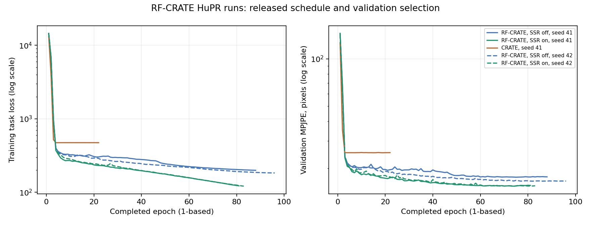

# RF-CRATE reproduction

## Headline results

Completed 2026-10-08: RF-CRATE-mini on HuPR with seeds 41 and 42, plus the CRATE-small baseline with seed 41. These are **test results from the best-validation checkpoints**. The other RF-CRATE paper datasets and baselines have not been run here.

The paper's Table 1 reports **RF-CRATE 17.09 ± 9.13 pixels** and **CRATE 24.93 ± 11.96 pixels**. Values were checked against the [authors' arXiv v2 manuscript](https://arxiv.org/html/2507.21799v2#S5.T1).

| Our model / setting | Seed | In-domain MPJPE | Cross-domain MPJPE | Paper-notebook aggregate | Training + testing |
| --- | ---: | ---: | ---: | ---: | ---: |
| RF-CRATE, effective released SSR-off behavior | 41 | 17.62 | 18.32 | 17.97 ± 8.64 | 1h 02m 31s |
| RF-CRATE, effective released SSR-off behavior | 42 | 16.69 | 17.43 | 17.06 ± 8.05 | 1h 07m 17s |
| RF-CRATE, SSR enabled | 41 | 15.51 | 17.08 | 16.30 ± 8.14 | 57m 03s |
| RF-CRATE, SSR enabled | 42 | 15.54 | 17.16 | 16.35 ± 8.33 | 58m 37s |
| CRATE-small | 41 | 25.14 | 24.66 | 24.90 ± 11.98 | 17m 49s |

Lower is better; all errors are image-coordinate pixels. Each job used one H100, 12 CPUs and 64 GiB RAM. Runtimes are completed Slurm allocation times, including both test domains and excluding queue wait, environment setup and cache construction. All five jobs completed with exit code 0.

The released `Paper_Table1.ipynb` averages the two domain means equally. Its displayed spread is the equal-weight average of the two domains' population standard deviations of per-frame MPJPE. **The ± values are not standard deviations across seeds.** In-domain testing scored 14,032 frames and cross-domain testing 49,792 frames, retaining the release's `drop_last=True` behavior.

The effective released configuration closely matches the paper in seed 42; enabling SSR improves both observed seeds. CRATE's aggregate closely matches its paper baseline, but its predictions are almost constant: mean coordinate SD across cross-domain predictions is 0.00151 pixels, versus 18.80 pixels for the targets. This aggregate match does not establish useful input-dependent pose learning.

These are close numerical reproductions under the **released code's protocol**. The split discrepancies below prevent a claim that the paper's stated protocol has been independently verified.

## Training and checkpoint selection

The released architectures, input representations, bone-length plus position MSE loss and optimizer schedule were retained. RF-CRATE uses complex inputs; CRATE uses Cartesian real/imaginary channels. Both configurations use AdamW, batch size 64, peak LR setting 0.001, betas (0.9, 0.99), weight decay 0.004, and the released warmup/cosine lambda with a 100-epoch horizon. Validation and test batch sizes are 16. Eight loader workers were used.

The smallest validation task loss selects the checkpoint; test metrics do not select configurations or epochs. The released patience is 20 epochs. All runs stopped through that rule before epoch 100:

| Setting / seed | Epochs trained | Selected epoch | Job |
| --- | ---: | ---: | ---: |
| RF-CRATE SSR off / 41 | 89 | 69 | 318129 |
| RF-CRATE SSR off / 42 | 97 | 77 | 318133 |
| RF-CRATE SSR on / 41 | 82 | 62 | 318130 |
| RF-CRATE SSR on / 42 | 84 | 64 | 318134 |
| CRATE / 41 | 23 | 3 | 318131 |

Epoch numbers here are one-based. The original early-stop branch exits before recording its final non-improving epoch, so saved history/latest-state files end one epoch earlier than the trained-epoch counts above. The selected checkpoint, the saved final evaluation weights and the latest state's stored best weights were checked tensor-by-tensor and match for every run.



Exact results, configurations, histories, logs, prediction/checkpoint hashes and source provenance: [seed 41](reproduction/evidence/hupr-20261008/results.json), [seed 42](reproduction/evidence/hupr-seed42-20261008/results.json), [runtimes](reproduction/evidence/runtimes.json).

## Release discrepancies and explicit changes

1. **SSR was silently disabled for the mini model.** `HuPR_rfcrate_mini.yaml` requests SSR, but `main.py` lacks a mini-model constructor branch and its broad exception handler disables the regularizer. The `released` arm preserves that effective off behavior. The `ssr` arm adds the missing branch using the mini model's four heads, 192 feature dimensions and the configured lambda of 5. The regularizer itself is unchanged. Neither arm proves which behavior produced the original paper result.
2. **The best-weight object aliased live parameters.** The release assigns `model.state_dict()` without copying its tensors. Our isolated snapshot uses `copy.deepcopy` and saves actual best weights. This fix applies to all arms, including the effective-release arm; they are not byte-identical reruns of the unmodified training loop.
3. **Configured recording IDs do not cover the released filenames consistently.** The YAML requests IDs 0–234; preprocessing retains HuPR's original sequence IDs up to 276. The literal loader selects 117 of 141 requested training recordings and 83 of 94 requested cross-domain recordings, omitting 35 of the 235 available recordings. Missing IDs and the exact selected order are preserved in [protocol.json](reproduction/evidence/hupr-20261008/protocol.json). We did not silently renumber recordings or invent a replacement split.
4. **The released split differs from the paper's stated official HuPR protocol.** The code randomly divides the 117-recording training pool into 42,120 training, 14,040 validation and 14,040 in-domain test frames, with the other 83 recordings supplying cross-domain testing. Official HuPR uses disjoint 193/21/21 train/validation/test recording lists. We retained the RF-CRATE code's split. Its “cross-domain” label does not, by itself, establish a subject-disjoint split. The seed changes the frame partition as well as initialization and training randomness.

For efficient loading, [build_hupr_cache.py](reproduction/build_hupr_cache.py) stores the existing preprocessed maps as complex64 NumPy memory maps. Its conversion was checked exactly at frames 0/300/599 of every recording. The replacement loader also matched the actual released loading and shape-conversion methods on checked complex, Cartesian and polar inputs. Cached labels are float64 before the unchanged training/evaluation function calls `.float()`; the float32 targets consumed by the model match exactly. The recorded directory order is retained because the release's unsorted file enumeration affects the seeded frame split.

Other snapshot changes preserve Slurm's GPU visibility, suppress progress bars, stop on nonfinite training loss, and save histories plus latest model/optimizer/scheduler/RNG state. The original model implementations remain unchanged. The [source patch](reproduction/source-changes.patch) replays onto base commit `8713663abd8578683544c0cf9c40c61064e8f06e`; replayed training sources and non-path configurations were checked against the executed snapshots. The additional saved optimizer state is a recovery record; this RF launcher does not implement automatic interrupted-run resume.

## Reproduce

Use a dedicated Python 3.8 environment. Install PyTorch 2.1.0 / torchvision 0.16.0 with CUDA 12.1, the repository requirements and TensorBoard 2.13.0. The complete [recorded environment](reproduction/evidence/hupr-20261008/environment.txt) is included.

```bash
python -m pip install torch==2.1.0 torchvision==0.16.0 --index-url https://download.pytorch.org/whl/cu121
python -m pip install -r requirements.txt tensorboard==2.13.0
```

The globally imported STFNet module also requires `pytorch-complex==0.1.1`. Its PyPI source archive lacks `HISTORY.rst`, which breaks installation. The successful repair adds only that documentation file; runtime sources are unchanged. In the dedicated environment:

```bash
rfcrate_pkg_tmp=$(mktemp -d)
curl --fail --location https://files.pythonhosted.org/packages/e4/1c/c82ada048f856d0a5be68840f48227189cdde2c59b7d3009eacb804f6a98/pytorch-complex-0.1.1.tar.gz --output "$rfcrate_pkg_tmp/source.tar.gz"
printf '%s  %s\n' d341d35da9cffb49fb6ef5fcb8566f0a76926634c428a4c39f327b1952fbb914 "$rfcrate_pkg_tmp/source.tar.gz" | sha256sum -c -
tar -xzf "$rfcrate_pkg_tmp/source.tar.gz" -C "$rfcrate_pkg_tmp"
touch "$rfcrate_pkg_tmp/pytorch-complex-0.1.1/HISTORY.rst"
python -m pip install --no-deps "$rfcrate_pkg_tmp/pytorch-complex-0.1.1"
```

Prepare an isolated campaign from the fork and the existing RF-CRATE-preprocessed HuPR pickle files. From this repository root:

```bash
python reproduction/prepare_hupr.py --campaign /path/to/new-campaign --radar-maps /path/to/RFHuPR/radar_maps --file-order reproduction/evidence/hupr-20261008/file-order.json --seed 41
python reproduction/build_hupr_cache.py --cache /path/to/new-campaign/cache
python reproduction/check_hupr_cache.py --cache /path/to/new-campaign/cache --radar-maps /path/to/RFHuPR/radar_maps
```

For another seed, prepare another campaign with `--seed 42 --cache /path/to/completed-cache` to reuse the maps. The recorded order must cover the same files exactly. Raw ADC preprocessing remains the upstream workflow under `Open_Datasets/HuPR/`; this cache conversion adds no radar transform.

In a GPU allocation, run each arm independently:

```bash
python reproduction/run_hupr.py --campaign /path/to/new-campaign --arm released
python reproduction/run_hupr.py --campaign /path/to/new-campaign --arm ssr
python reproduction/run_hupr.py --campaign /path/to/new-campaign --arm crate
python reproduction/summarize_hupr.py --campaign /path/to/new-campaign
```

`--smoke` performs a short finite-gradient check without keeping a trained checkpoint. The normal command trains and evaluates the selected checkpoint on both test domains. It refuses an already-started arm to prevent duplicate work or overwriting results. [hupr_job.sbatch](reproduction/hupr_job.sbatch) submits one arm per independent job, with no concurrency cap; `RFCRATE_ROOT` and `RFCRATE_PYTHON` override its cluster defaults.

The completed cluster campaigns, environments, caches, predictions and checkpoints remain under ignored `local/` paths. `local/env-rfcrate` points to the preserved dedicated environment. Large assets are not committed; the fork contains the reproduction tools and compact evidence. Current launchers accept configurable campaign paths; exact historical launchers used for these results are retained in the evidence directories.

The final configurable launcher was checked in a fresh seed-42 campaign using the shared cache: its real-data finite-gradient smoke job completed successfully in 13 seconds (318199). Source replay, loader equivalence and duplicate-run protection were also checked.
